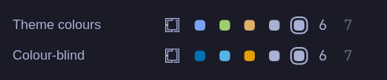

# Multi-monitor Workspaces for Omarchy

A workspace widget for the [Omarchy](https://omarchy.org/) bar, built for multi-monitor setups.

The stock widget only marks the focused workspace. With several screens, the workspaces on the other screens look the same as empty ones.
This widget gives **every workspace that's on a screen** a pip. Each monitor's bar shows which workspace belongs to it, and which one has focus.

**Focused monitor**:


**Another monitor**:


Workspace 2 is on a third screen playing a fullscreen video, so it has a ring on both bars.

## Every state, both palettes

A staged bar showing every pip state at once. On a real setup, blue and green never appear on the same bar.



From left to right: focused here · focused on another monitor · this monitor's workspace · on another monitor · fullscreen (ring) · has windows · empty.

## What the pips mean

| Pip | Meaning |
|---|---|
| 🔵 blue | Focused workspace, on the bar of the monitor showing it |
| 🟢 green | Focused workspace, as seen from the other monitors' bars |
| 🟡 yellow | This monitor's workspace, when this monitor isn't focused |
| ⚪ white | Workspace on another, unfocused monitor |
| number | Not on any screen (dim when empty) |
| ring around it | Workspace has a fullscreen window (game, video) |

On a single monitor it behaves like the stock widget, plus the fullscreen ring.

## Install

```bash
omarchy plugin add https://github.com/littleme02/omarchy-multimon-workspaces.git --enable
```

This installs the widget and puts it in the bar. To replace the stock workspaces widget, remove `omarchy.workspaces` from the bar layout in `~/.config/omarchy/shell.json`.
To update later, run `omarchy plugin update littleme.multimon-workspaces`.

## Colours

By default the colours come from your current theme's `colors.toml` (`blue`, `green`, `yellow`, plus the bar's text colour for white), so they follow theme changes.
To override them, add settings to the widget's entry in `~/.config/omarchy/shell.json`:

```json
{
  "id": "littleme.multimon-workspaces",
  "focusedColor": "#7aa2f7",
  "focusedElsewhereColor": "#9ece6a",
  "localColor": "#e0af68"
}
```

## Colour-blind mode

Green and yellow are hard to tell apart with red-green colour blindness, the most common kind. Set `colorblind` to switch to the [Okabe-Ito](https://jfly.uni-koeln.de/color/) colour-blind-safe palette:

```json
{
  "id": "littleme.multimon-workspaces",
  "colorblind": true
}
```

| Pip | Default (theme) | Colour-blind mode |
|---|---|---|
| Focused, this monitor | blue | blue `#0072B2` |
| Focused, another monitor | green | sky blue `#56B4E9` |
| This monitor's workspace | yellow | orange `#E69F00` |
| On another monitor | white | white |

Explicit `focusedColor` / `focusedElsewhereColor` / `localColor` settings still take priority.

## How it works

- **No scripts or services.** It's a single QML file that reads Quickshell's live Hyprland state: monitors, their active workspaces, focus and fullscreen.
- **Works with any monitors.** Nothing is tied to specific screens. Each bar asks which output it's on and compares by output name, so new, hot-plugged or reconnected screens (including USB-C docks) work without a restart.
- **Pixel-exact pips.** The pip and ring are drawn as shapes, not font glyphs, so they stay centred at any monitor scale.
- **Workspaces shown:** 1–5 always, plus any others from 6–10 that exist, the same as the stock widget.

## Requirements

- Omarchy 4 (Quickshell-based shell, Hyprland with Lua config). Tested with Quickshell 0.3.1.

## Troubleshooting

If a change to the plugin doesn't show up, run `omarchy restart shell`. The shell's plugin hot reload doesn't always pick up edits.

## License

MIT
